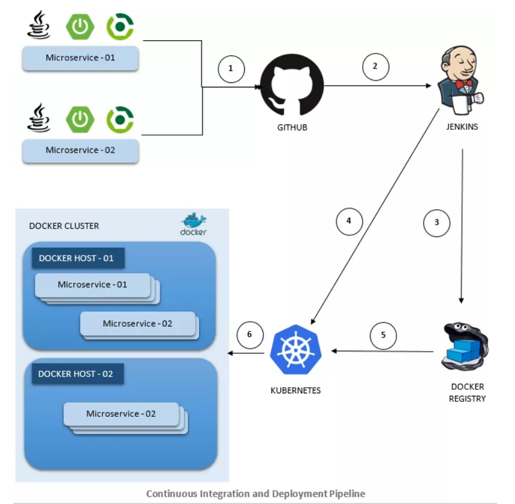

## Goal: 
### Create a Continuous Integration and Continuous Delivery Pipeline and automate the following steps.

1. Checkout code.  
2. Compile code.  
3. Run test cases.  
4. Build docker image.  
5. Push image to docker registry.  
6. Pull new images from registry.  
7. Deploy and manage images and containers.  

## Technologies: 
### Springboot framework, Spring STS 4, Maven, Jenkins, Docker, Kubernetes

## Environment Setup:

1. Install Java jdk  
2. Install and Configure the STS tool to run the spring boot app.
3. Clone the repository and Import it in the STS IDE.

### Jenkins Setup
1. Create a instance on the google compute engine.
2. Install and configure Jenkins (https://www.youtube.com/playlist?list=PLS1QulWo1RIbY8xXPqz6ad_sNHkIP3IXI) according to the requirements. 

### Kubernetes Setup.
1. Create a kubernetes cluster on the google compute engine. (https://cloud.google.com/solutions/jenkins-on-kubernetes-engine)

## Architecture: 

## References:

https://www.youtube.com/playlist?list=PLS1QulWo1RIbY8xXPqz6ad_sNHkIP3IXI  
https://cloud.google.com/solutions/jenkins-on-kubernetes-engine  
https://betsol.com/2018/11/devops-using-jenkins-docker-and-kubernetes/
